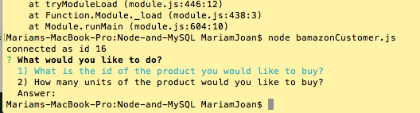

# Node-and-MySQL
## Overview

Here I created an Amazon-like storefront with MySQL. The application will take in orders from customers and deplete stock from the store's inventory. I used `npm inquirer` included screenshots of typical user flows through the application.

### Process:

1. Create a MySQL Database called `bamazon`.

*MySQL Database created called `bamazon`.*

2. Then create a Table inside of that database called `products`.

3. The products table should have each of the following columns:

   * item_id (unique id for each product)

   * product_name (Name of product)

   * department_name

   * price (cost to customer)

   * stock_quantity (how much of the product is available in stores)

*MySQL Database products table created with desciptive columns for id, product name, department name, price, and stock.*

4. Populate this database with around 10 different products. (i.e. Insert "mock" data rows into this database and table).

*MySQL Database products table created populated with 10 products.*

5. Then create a Node application called `bamazonCustomer.js`. Running this application will first display all of the items available for sale. Include the ids, names, and prices of products for sale.

*Node.js application `bamazonCustomer.js` showing all products for sale.*

6. The app should then prompt users with two messages.

   * The first should ask them the ID of the product they would like to buy.
   * The second message should ask how many units of the product they would like to buy.

*Node.js application `bamazonCustomer.js` showing user prompts.*

7. Once the customer has placed the order, your application should check if your store has enough of the product to meet the customer's request.

   * If not, the app should log a phrase like `Insufficient quantity!`, and then prevent the order from going through.

8. However, if your store _does_ have enough of the product, you should fulfill the customer's order.
   * This means updating the SQL database to reflect the remaining quantity.
   * Once the update goes through, show the customer the total cost of their purchase.

*Node.js application `bamazonCustomer.js` showing if product is not in stock. Then updating MySQL inventory
to show user final order total amount.*
